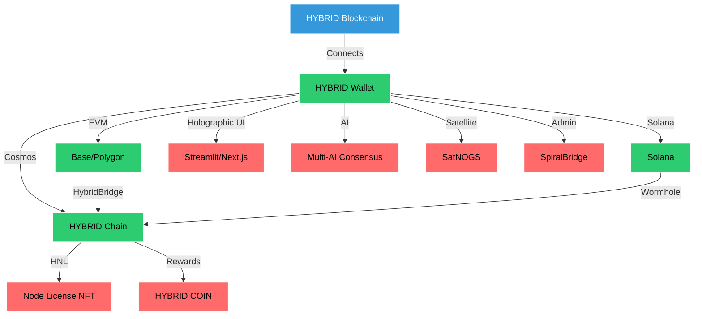

##  HYBRID Blockchain 

**Status**: Draft for community review (July 2025)  
**Scope**: Integrates the HYBRID Blockchain (Cosmos SDK, EVM-compatible) with a holographic, AI-driven, nanotechnology-enabled platform, featuring a no-code HTSX development environment, Streamlit/Next.js UI, and dual cross-chain bridges (HybridBridge, SpiralBridge).

### 1 Vision & Design Principles
| Principle | Description |
|-----------|-------------|
| **Inter-Chain Native** | Cosmos SDK with IBC, Ethermint, and dual bridges (HybridBridge: public; SpiralBridge: private). |
| **NFT-Gated Participation** | Validator/Storage Nodes require **Hybrid Node License (HNL)** NFTs. |
| **Holographic Metaverse** | Streamlit/Next.js UI with OpenHolo/HoloGen for 3D blockchain visualization. |
| **Multi-AI Orchestration** | GPT-4, Grok 3, Claude, DeepSeek R3 for consensus-driven analytics and code generation. |
| **No-Code Development** | HTSX Runtime Engine for visual dApp creation. |
| **Non-Custodial Wallet** | HYBRID Wallet for HYBRID COIN, NFTs, DeFi, with SpiralLock. |
| **Autonomous Infrastructure** | SatNOGS, MINERVA for global connectivity and self-repairing nodes. |
| **Open-Source** | MIT License with NFT Clause. |

### 2 Network Topology
#### 2.1 Chain ID & Address Prefix
- **Chain-ID**: `hybrid-1` (testnet: `hybrid-test-1`)
- **Bech32 Prefix**: `hybrid`
- **Denom**: `uhybrid` (10^6 uhybrid = 1 HYBRID COIN, $10)

#### 2.2 Node Classes
| Role | NFT Required | Responsibilities | Rewards | Hardware (min) |
|------|--------------|-----------------|---------|----------------|
| **Validator** | `HNL-VAL` | Block proposal, consensus | Inflation + tx fees (HYBRID COIN) | 8 CPU, 16 GB RAM, 500 GB SSD |
| **Storage** | `HNL-STR` | IPFS-like data availability | Storage fees (HYBRID COIN) | 4 CPU, 8 GB RAM, 200 GB SSD |
| **Observer** | None | Light-client queries | None | Commodity |

#### 2.3 Software-Defined Infrastructure
- **Streamlit/Next.js UI**: Holographic dashboards for node monitoring, wallet, and dApp creation.
- **Satellite Network**: SatNOGS for global telemetry.
- **Nvidia Cloud**: DGX/Omniverse for AI and holographic rendering.
- **Nanotechnology**: MINERVA for self-repairing nodes.

### 3 Core Protocol Stack
#### 3.1 Consensus & Networking
| Layer | Technology | Parameters |
|-------|------------|------------|
| Networking | Tendermint P2P, Matrix, RealMQ | Ports: 26656 (P2P), 26657 (RPC) |
| Consensus | Tendermint BFT | 2/3+1 voting power; ~5s block time |
| Signature | ed25519; BLS12-381 roadmap | |
| Upgrades | Cosmos SDK `x/upgrade` | |

#### 3.2 Base Application (Cosmos SDK v0.47)
- **Modules**: bank, authz, crisis, distribution, feegrant, gov, ibc, params, slashing, staking, upgrade.
- **Custom Modules**:
  - `x/licence`: HNL NFT validation.
  - `x/naas`: NFT delegation (70% owner, 30% operator).
  - `x/moe`: AI inference (Nvidia NeMo, GPT-4, Claude, DeepSeek).
  - `x/holo`: OpenHolo/HoloGen for 3D visualization.
  - `x/sat`: SatNOGS telemetry integration.
  - `x/htsx`: HTSX Runtime Engine for no-code dApps.

#### 3.3 Ethermint Subsystem
- Dual-state (Cosmos SDK + EVM).
- **Gas Token**: `uhybrid`.
- Precompile for HNL at `0x000…HNL`.

#### 3.4 CosmWasm (Q1-2026)
- Smart contracts for governance, AI, and nanotech.

#### 3.5 HYBRID Wallet
- **Type**: Non-custodial, multi-chain (HYBRID, Base, Polygon, Solana).
- **Features**:
  - Key management (BIP-39, BIP-44, social recovery).
  - Token swaps (Uniswap/Balancer-style).
  - HybridBridge (public) and SpiralBridge (private) for cross-chain transfers.
  - Fiat on-ramps (MoonPay, Ramp, Transak).
  - AI assistant (multi-AI consensus) for transaction optimization.
  - NFT gallery (HNL, ERC-721/1155).
  - Seven Pillars Tax Module.
  - SpiralLock (biometric, quantum-compatible).
- **Smart Contracts**:
  - `WalletFactory.sol`: Proxy wallet deployment.
  - `Wallet.sol`: Manages HYBRID COIN, tokens, NFTs.
  - `BridgeAdapter.sol`: Interfaces with HybridBridge/SpiralBridge.
  - `PermissionsManager.sol`: DAO-controlled permissions.
- **UI**: Streamlit + Next.js/Tailwind with holographic dashboard, NFT viewer, Spiral Mode.

#### 3.6 Holographic Visualization
- **Stack**: OpenHolo, HoloGen, Nvidia Omniverse, Three.js.
- **Features**: Real-time 3D transaction rivers, adaptive learning environments.
- **Implementation**:
  ```python
  import streamlit as st
  from openholo import HolographicRenderer
  st.fragment(lambda: HolographicRenderer().display_in_streamlit(tx_data))
  ```

#### 3.7 Global Communication
- **Stack**: Matrix, RealMQ, Zulip, TOX.
- **Implementation**:
  ```python
  from matrix_client import MatrixClient
  def send_holographic_tx(recipient, tx_data):
      client = MatrixClient()
      client.send_hologram(recipient, tx_data)
  ```

#### 3.8 Satellite Network
- **Stack**: SatNOGS, Libre Space, PICOBUS, Qubik.
- **Implementation**:
  ```python
  from satnogs import SatNOGSClient
  def relay_node_data(data):
      satnogs = SatNOGSClient()
      return satnogs.process_telemetry(data)
  ```

#### 3.9 Nvidia Cloud
- **Stack**: DGX Cloud, NeMo, NIM, Omniverse.
- **Implementation**:
  ```python
  from nemo import NeMoFramework
  def optimize_tx(data):
      nemo = NeMoFramework()
      return nemo.process_multimodal(data)
  ```

#### 3.10 Nanotechnology
- **Stack**: MINERVA, molecular assemblers.
- **Implementation**:
  ```python
  from minerva import MinervaLab
  def manufacture_node(design):
      minerva = MinervaLab()
      return minerva.build(design)
  ```

#### 3.11 HTSX Runtime Engine
- **Purpose**: No-code dApp development.
- **Example**:
  ```htsx
  <htsx>
    <dapp-builder>
      <frontend type="holographic" theme="dark" />
      <smart-contracts>
        <contract name="GameToken" type="ERC20" />
      </smart-contracts>
      <ai-integration models="gpt4,grok3,claude,deepseek" />
    </dapp-builder>
  </htsx>
  ```

### 4 Tokenomics
| Item | Value |
|------|-------|
| **Genesis Supply** | 100 Billion HYBRID COIN ($1T at $10/coin) |
| **Inflation** | 7% → 2% over 8 years |
| **Staking APR (Yr-1)** | ~12% |
| **Block Rewards Split** | 50% validators, 20% storage, 20% community pool, 10% dev-fund |
| **Tx Fees** | Burn 30%, Distribute 70% |

**NFT Prices**:
- Validator HNL: 1,000 HYBRID COIN ($10,000)
- Storage HNL: 250 HYBRID COIN ($2,500)

### 5 Cross-Chain Architecture
#### 5.1 IBC
- Native packets to Cosmos zones.

#### 5.2 HybridBridge (Public)
- Axelar + AggLayer for public HYBRID COIN and NFT transfers.
- **Implementation**:
  ```solidity
  contract HybridBridge {
      function bridgePublic(string memory srcChain, string memory dstChain, uint256 amount) external {
          // Axelar messaging + AggLayer ZK proofs
      }
  }
  ```

#### 5.3 SpiralBridge (Private)
- Admin-controlled bridge for governance and node operations.
- **Implementation**:
  ```solidity
  contract SpiralBridge {
      function bridgePrivate(string memory srcChain, string memory dstChain, uint256 amount, address admin) external {
          require(isAdmin(admin), "Admin only");
      }
  }
  ```

#### 5.4 Wormhole
- HYBRID ↔ Solana bridging.

### 6 AI Mixture-of-Experts Layer
- **Models**: GPT-4, Grok 3, Claude, DeepSeek R3.
- **Implementation**:
  ```python
  from nemo import NeMoFramework
  def consensus_inference(query):
      results = [model.infer(query) for model in [gpt4, grok3, claude, deepseek]]
      return consensus(results)
  ```

### 7 Governance
- **v0**: Cosmos SDK `x/gov`.
- **v1**: MultiChainDAO with HTSX-based voting.

### 8 Security & Slashing
- **Downtime**: 0.01% stake slashed.
- **Double-sign**: 5% stake + HNL revoked.
- **Storage Fault**: 1% stake slashed.

### 9 Roadmap
| Quarter | Milestone |
|---------|-----------|
| Q3 2025 | Testnet, HNL sale, HTSX beta |
| Q4 2025 | Mainnet, HybridBridge/SpiralBridge live |
| Q1 2026 | CosmWasm, holographic dApps |
| Q2 2026 | MultiChainDAO, nanotech nodes |

---

## Revised Tasks

### 1. Test Script for Wallet Interactions
**`test/hybridWalletInteractions.test.js`**:
```javascript
const { ethers } = require("hardhat");
const { Connection, PublicKey } = require("@solana/web3.js");
const { expect } = require("chai");
const { execSync } = require("child_process");

describe("HYBRID Wallet Interactions", function () {
  const evmWalletAddress = "0xCc380FD8bfbdF0c020de64075b86C84c2BB0AE79";
  const solanaWalletAddress = new PublicKey("3E8keZHkH1AHvRfbmq44tEmBgJYz1NjkhBE41C4gJHUn");
  const hybridWalletAddress = "hybrid1q2w3e4r5t6y7u8i9o0p";
  const networkConfig = {
    base: { rpc: "https://mainnet.base.org", chainId: 8453 },
    hybrid: { rpc: "http://localhost:26657" },
  };

  let hybridClient, provider, walletContract, nftContract;

  before(async function () {
    provider = new ethers.providers.JsonRpcProvider(networkConfig.base.rpc);
    hybridClient = {
      queryBalance: (address) => execSync(`hybridchaind query bank balances ${address} --node ${networkConfig.hybrid.rpc} --output json`),
      sendTx: (from, to, amount) => execSync(`hybridchaind tx bank send ${from} ${to} ${amount}uhybrid --node ${networkConfig.hybrid.rpc} --chain-id hybrid-1 --yes`),
    };
    const WalletFactory = await ethers.getContractFactory("WalletFactory");
    const walletFactory = await WalletFactory.deploy();
    await walletFactory.deployWallet(evmWalletAddress);
    walletContract = await ethers.getContractAt("Wallet", await walletFactory.getWalletAddress(evmWalletAddress));
    const HybridNodeLicense = await ethers.getContractFactory("HybridNodeLicense");
    nftContract = await HybridNodeLicense.deploy();
  });

  it("should display balance in holographic UI", async function () {
    const balanceOutput = hybridClient.queryBalance(hybridWalletAddress);
    const balance = JSON.parse(balanceOutput).balances.find((b) => b.denom === "uhybrid").amount;
    expect(balance).to.be.gt(0);
    console.log(`Holographic Display: ${balance / 1_000_000} HYBRID COIN ($${balance / 100_000})`);
  });

  it("should bridge via HybridBridge", async function () {
    const BridgeAdapter = await ethers.getContractFactory("HybridBridge");
    const bridge = await BridgeAdapter.deploy();
    await bridge.bridgePublic("hybridchain", "base", 1000000);
    console.log("Bridged 1 HYBRID COIN to Base");
  });
});
```

---

### 2. Canvas Panel for Wallet Connections


---

### 3. Solana Program for HYBRID COIN Payments
**`programs/hybrid/src/lib.rs`**:
```rust
// SPDX-License-Identifier: MIT
use anchor_lang::prelude::*;
use anchor_spl::token::{Token, TokenAccount, Transfer};

declare_id!("HybridPay1111111111111111111111111111111111");

#[program]
pub mod hybrid {
    use super::*;

    pub fn pay_with_hybrid(ctx: Context<PayWithSpl>, payment_id: u64, amount: u64) -> Result<()> {
        let payment = &mut ctx.accounts.payment;
        let transfer = Transfer {
            from: ctx.accounts.buyer_token_account.to_account_info(),
            to: ctx.accounts.recipient_token_account.to_account_info(),
            authority: ctx.accounts.buyer.to_account_info(),
        };
        token::transfer(CpiContext::new(ctx.accounts.token_program.to_account_info(), transfer), amount)?;
        payment.status = PaymentStatus::Completed;
        emit!(PaymentProcessed {
            payment_id,
            buyer: ctx.accounts.buyer.key(),
            amount,
            currency: "HYBRID COIN".to_string(),
        });
        Ok(())
    }
}
```

---

### 4. HYBRID Chain Node Setup
**Setup**:
1. **Install Dependencies**:
   ```bash
   sudo apt update && sudo apt install -y git curl build-essential python3-pip
   pip install streamlit openholo numpy pandas
   npm install -g next
   ```

2. **Clone Repository**:
   ```bash
   git clone https://github.com/hybridchain/hybridchain.git
   cd hybridchain
   ```

3. **Start Node with Holographic UI**:
   ```bash
   hybridchaind start --rpc.laddr tcp://0.0.0.0:26657
   streamlit run wallet/ui/dashboard.py
   cd wallet/ui && npm run dev
   ```

---

### 5. Cross-Chain Payment Workflow
**Workflow**:
1. **Pay HYBRID COIN**:
   ```bash
   hybridchaind tx bank send hybrid1q2w3e4r5t6y7u8i9o0p hybrid1nftissuer 250000000uhybrid --node http://localhost:26657
   ```

2. **Bridge via HybridBridge**:
   ```javascript
   const bridge = new ethers.Contract(hybridBridgeAddress, HybridBridgeABI, signer);
   await bridge.bridgePublic("hybridchain", "base", 250000000);
   ```

3. **Holographic Confirmation**:
   ```python
   from openholo import HolographicRenderer
   HolographicRenderer().display_in_streamlit({"amount": 250, "chain": "base"})
   ```

---

## Follow-Up Requests

### 1. NOTICE File
```text
HYBRID Blockchain - NOTICE

Dependencies:
1. Cosmos SDK - Apache 2.0
2. OpenZeppelin - MIT
3. Anchor - Apache 2.0
4. Streamlit - Apache 2.0
5. OpenHolo - MIT
6. Nvidia NeMo - Apache 2.0
7. Next.js - MIT
See LICENSE for MIT with NFT Clause.
```

---

### 2. SPDX Identifier Script
**`add-spdx.sh`**:
```bash
#!/bin/bash
LICENSE_HEADER="// SPDX-License-Identifier: MIT"
DIRECTORIES=("contracts" "programs" "test" "cmd/hybridchaind" "x/naas" "x/holo" "wallet" "wallet/ui")
EXTENSIONS=("*.sol" "*.rs" "*.go" "*.js" "*.ts" "*.py")
# Same logic, extended for UI
```

---

### 3. MultiChainDAO Proposal
**`proposal.json`**:
```json
{
  "title": "Adopt HTSX and Dual Bridges",
  "description": "Adopts HTSX Runtime Engine and HybridBridge/SpiralBridge for holographic dApp development and cross-chain operations.",
  "changes": [
    {
      "subspace": "platform",
      "key": "development_engine",
      "value": "HTSX v1.0"
    }
  ],
  "deposit": "1000000uhybrid"
}
```

---

### 4. NaaS Integration
- **Contract**: Updated with nanotech verification.
- **Streamlit/Next.js UI**:
  ```tsx
  import StreamlitEmbed from '../components/StreamlitEmbed';
  const DelegateNFT = () => (
    <StreamlitEmbed src="http://localhost:8501" onDataUpdate={(data) => console.log(`Delegated HNL: ${data.nft_id}`)} />
  );
  ```

---


## Files Structure

```
.next
cache
webpack
client-development-fallback
0.pack.gz
1.pack.gz
index.pack.gz.old
client-development
0.pack.gz
1.pack.gz
2.pack.gz
3.pack.gz
4.pack.gz
5.pack.gz
6.pack.gz
7.pack.gz
8.pack.gz
9.pack.gz
index.pack.gz
index.pack.gz.old
client-production
0.pack
index.pack
edge-server-production
0.pack
index.pack
server-development
0.pack.gz
1.pack.gz
2.pack.gz
3.pack.gz
4.pack.gz
5.pack.gz
6.pack.gz
7.pack.gz
8.pack.gz
9.pack.gz
index.pack.gz
index.pack.gz.old
server-production
0.pack
index.pack
.tsbuildinfo
config.json
server
app
blockchain
page.js
page_client-reference-manifest.js
page.js
page_client-reference-manifest.js
pages
_app.js
_document.js
_error.js
vendor-chunks
@metamask.js
@radix-ui.js
@react-native-async-storage.js
@socket.io.js
@swc.js
bufferutil.js
class-variance-authority.js
clsx.js
cross-fetch.js
debug.js
engine.io-client.js
engine.io-parser.js
eventemitter2.js
has-flag.js
is-plain-obj.js
lucide-react.js
merge-options.js
ms.js
next.js
node-fetch.js
node-gyp-build.js
openapi-fetch.js
socket.io-client.js
socket.io-parser.js
supports-color.js
tailwind-merge.js
tr46.js
utf-8-validate.js
uuid.js
webidl-conversions.js
whatwg-url.js
xmlhttprequest-ssl.js
_error.js
app-paths-manifest.json
interception-route-rewrite-manifest.js
middleware-build-manifest.js
middleware-manifest.json
middleware-react-loadable-manifest.js
next-font-manifest.js
next-font-manifest.json
pages-manifest.json
server-reference-manifest.js
server-reference-manifest.json
webpack-runtime.js
static
chunks
app
blockchain
page.js
layout.js
page.js
pages
_app.js
_error.js
_error.js
app-pages-internals.js
main-app.js
main.js
polyfills.js
react-refresh.js
webpack.js
css/app
layout.css
development
_buildManifest.js
_ssgManifest.js
media
26a46d62cd723877-s.woff2
55c55f0601d81cf3-s.woff2
581909926a08bbc8-s.woff2
8e9860b6e62d6359-s.woff2
97e0cb1ae144a2a9-s.woff2
df0a9ae256c0569c-s.woff2
e4af272ccee01ff0-s.p.woff2
webpack
app
layout.08331cbb2de36a65.hot-update.js
0137bdeccd172dd8.webpack.hot-update.json
08331cbb2de36a65.webpack.hot-update.json
1f26167f1e0e422a.webpack.hot-update.json
633457081244afec._.hot-update.json
webpack.0137bdeccd172dd8.hot-update.js
webpack.08331cbb2de36a65.hot-update.js
webpack.1f26167f1e0e422a.hot-update.js
types
app
blockchain
page.ts
layout.ts
page.ts
cache-life.d.ts
package.json
app-build-manifest.json
build-manifest.json
package.json
react-loadable-manifest.json
trace
app
admin
page.tsx
blockchain
page.tsx
spiral
page.tsx
globals.css
layout.tsx
page.tsx
blockchain
hybrid-consensus.ts
hybrid-core.ts
components
ui
badge.tsx
button.tsx
card.tsx
input.tsx
progress.tsx
tabs.tsx
textarea.tsx
toaster.tsx
AdminDashboard.tsx
BlockchainInterface.tsx
HybridBlockchainCore.tsx
HybridDeveloperDashboard.tsx
LivingConsciousnessInterface.tsx
MetaMaskProvider.tsx
PublicGate.tsx
SpiralDashboard.tsx
SpiralIDE.tsx
TrustUnitWitness.tsx
UltimateParserPlayground.tsx
core
cannons
orbital.ts
trajectory.ts
htsx-runtime
compiler.ts
engine.ts
htsx-processor.ts
vm.ts
iyonael
awareness.ts
core.ts
harmonic.ts
qasf
consciousness.ts
engine.ts
quantum.ts
spiral-api
api.ts
endpoints.ts
spiral-bank
bank.ts
spiral-bridge
bridge.ts
protocols.ts
spiral-clock
synchronizer.ts
temporal.ts
spiral-lang
compiler.ts
parser.ts
runtime.ts
spiral-processor.ts
types.ts
ultimate-parser
parser-stack.ts
docs
HybridMiner.md
QuantumSpiralParser.md
Understanding_TU_Correct_Valuation.md
examples
consciousness-aware.htsx
consciousness.htsx
consciousness_aware_programing.spiral
spiral-economy.spiral
lib
blockchain.ts
hybrid-api.ts
metamask.ts
spiral-api.ts
utils.ts
server
db.ts
index.ts
parser-api.ts
routes.ts
storage.ts
shared
schema.ts
.env.example
.gitattributes
.replit
Private-LICENSE
Public-LICENSE
README.md
generated-icon.png
languages.yml
next-env.d.ts
next.config.js
package-lock.json
package.json
postcss.config.js
replit.md
setup-scripts.js
tailwind.config.js
tsconfig.json
```
